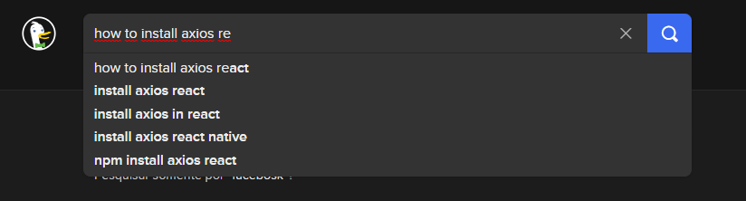
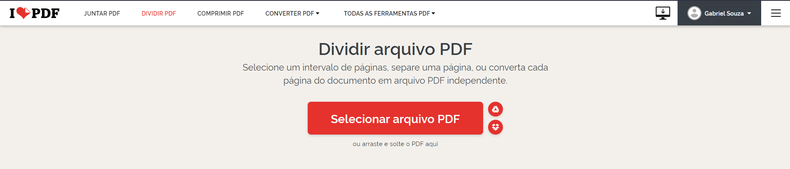
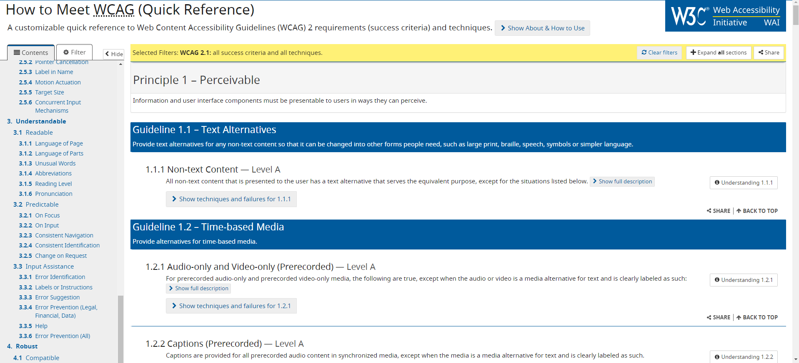
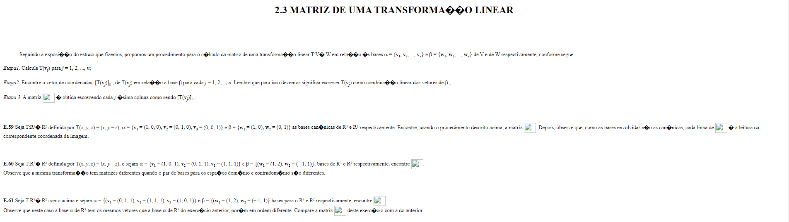
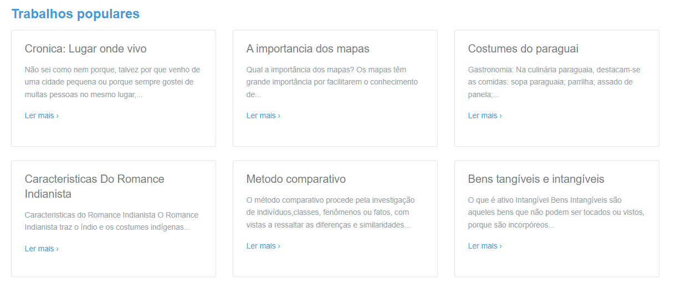
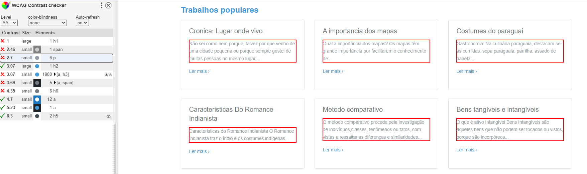

# Acertos
## 3.3.6 - Compreensível / Assistencia de Inputs/Entradas / Prevenção de erros

Um bom exemplo da heurística de prevenção de erros é a aba de pesquisa do DuckDuckGo, ao dar sugestões para completar a pesquisa, o site previne possíveis erros que o usuário pode cometer, mesmo utilizando outra lingua como pesquisa

## 2.4.6 Operavel / Navegabilidade / Titulos e rotulos

Uma pagina, para guiar o usuario corretamente precisa mostrar a cada aba navegavel o seu intuito do que ela quer passar para o usuario, e o titulo é o responsavel por demontrar isso muito bem, aplicações que utilizam isso acabam deixando mais claro o quer passar de forma curta e objetiva. Como mostrado no I❤PDF, ele mostra o objetivo da aba de forma simples atráves do titulo e no rotulo passa o que tem que fazer de forma clara e objetiva

## 3.1.1 Compreensível / Legivel / Linguagem da pagina

# Erros

## 3.1.5 - Compreensivel / Legivel / Nível de leitura

Por ser um site cheio de informações sobre euristicas, os itens tendem a ficar juntos na maioria das vezes, fazendo assim você voltar para o inicio do texto/topico para relembrar onde está

O site, mesmo que eu esteja no dominio original que é ingles, ele adapta para o idioma que estamos usando

## 1.1.1 Percepitivel / Texto Alternativo / Texto sem contexto

Para o usuario que entrar no site, ele provavelmente irá sair imediatamente, pois não tem como descobrir o que está passando dentro do propio website, além das coisas não carregarem os texto não estão nem legiveis para ter um contexto do mesmo.

## 1.4.3 Percepitivel / Distinguíveis / Contraste

Por ser um site já de fundo branco, os textos serem quase da mesma tonalidade do fundo acaba fazendo o usuario forçar para tentar compreender o que está escrito dentro das caixas de informação 

### WCAG Contrast checker

Outro erro de contraste é relacionado ao site da EBay, onde ele aparenta um contraste ruim para divulgar algum item de valor, assim como sua organização do botão e esquema de cores não colaboram muito

